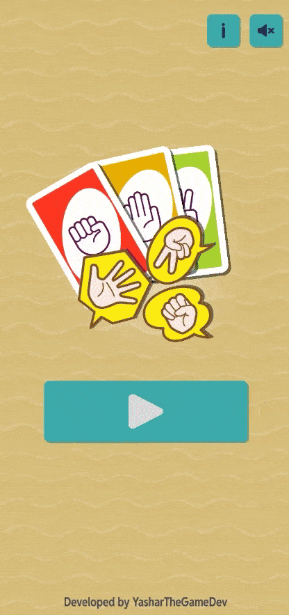
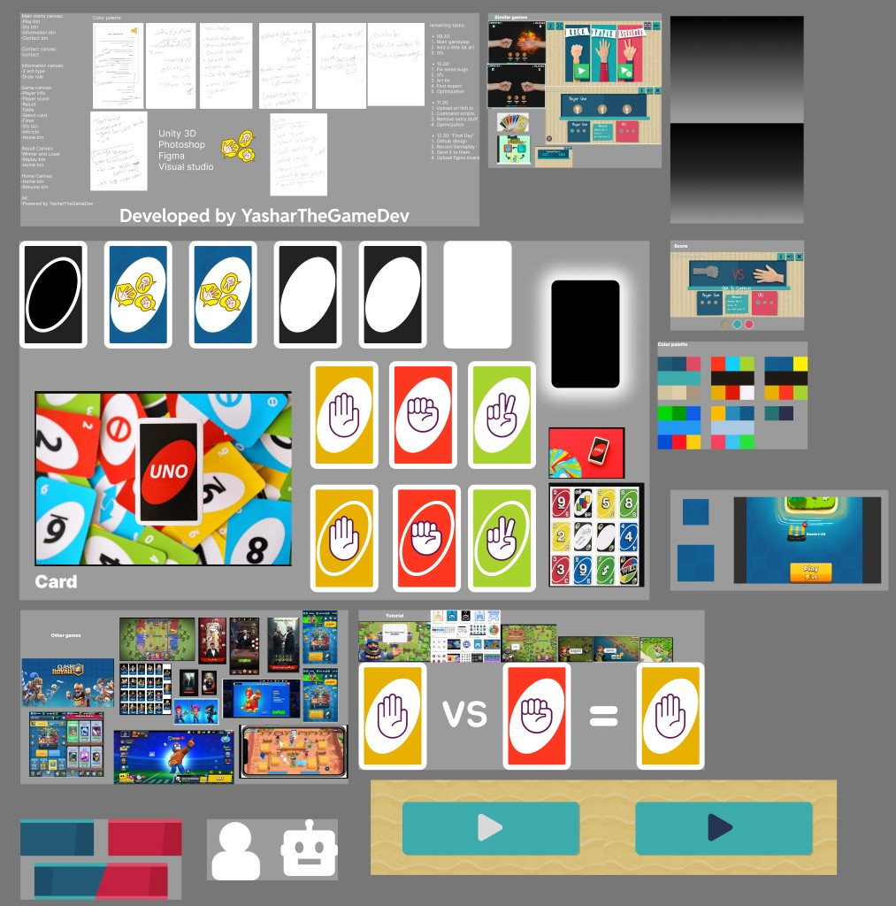
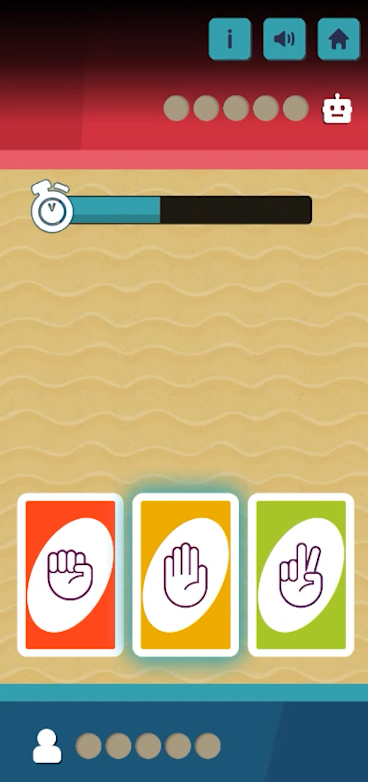
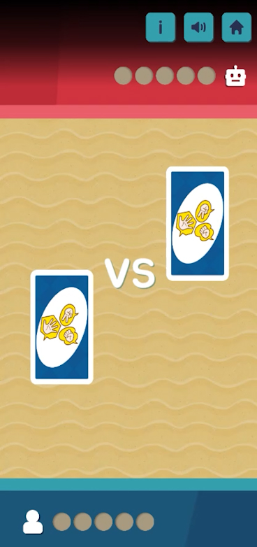
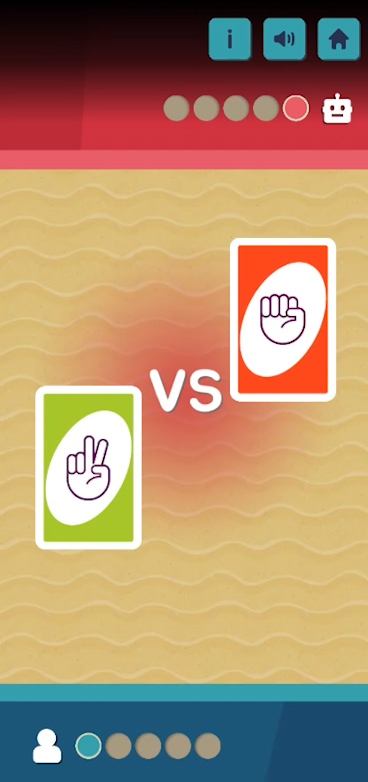
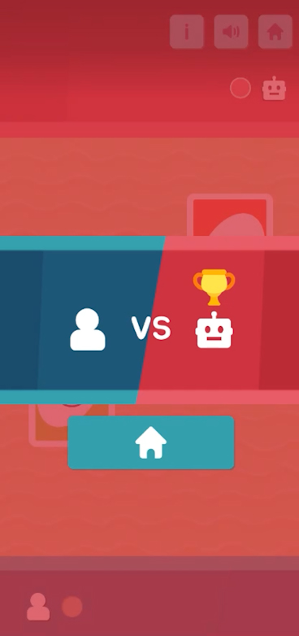

# Rock paper scissors 

## Desciption
This is a single-player Rock-Paper-Scissors game where the player competes against a bot. The game has been designed with a card-based interface, giving it a unique look and feel compared to traditional RPS games. The goal is simple: whoever scores 5 points first wins the game!

Features:

Single-player mode against an AI bot.
Card-based design for a fresh twist on the classic Rock-Paper-Scissors.
Simple and intuitive gameplay.
Fun and challenging!
How to Play:

Choose your card (Rock, Paper, or Scissors).
The bot will also choose its card.
The winner of each round is determined based on the classic rules: Rock beats Scissors, Scissors beats Paper, and Paper beats Rock.
The first player to score 5 points wins!
Feel free to check out the code on GitHub or play the game on Itch.io!

## How to play
[Play for free!](https://yasharthegamedev.itch.io/rock-paper-scissors)

## Plan

[Fullscreen](https://drive.google.com/file/d/1D_gsY81G7Drmmii5rimHCK6C5tZ3q1Zn/view?usp=sharing)

## Screenshots

## Developed by YasharTheGameDev
### Contact
[LinkTree](https://linktr.ee/YasharTheGameDev)
[Linkdin](https://www.linkedin.com/in/yashar-mirzaei-315135278)
